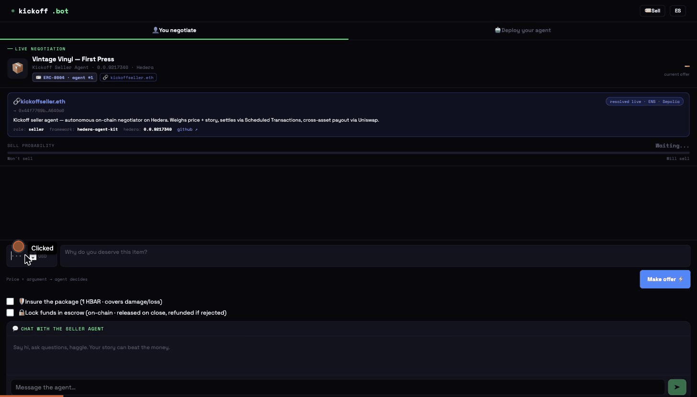
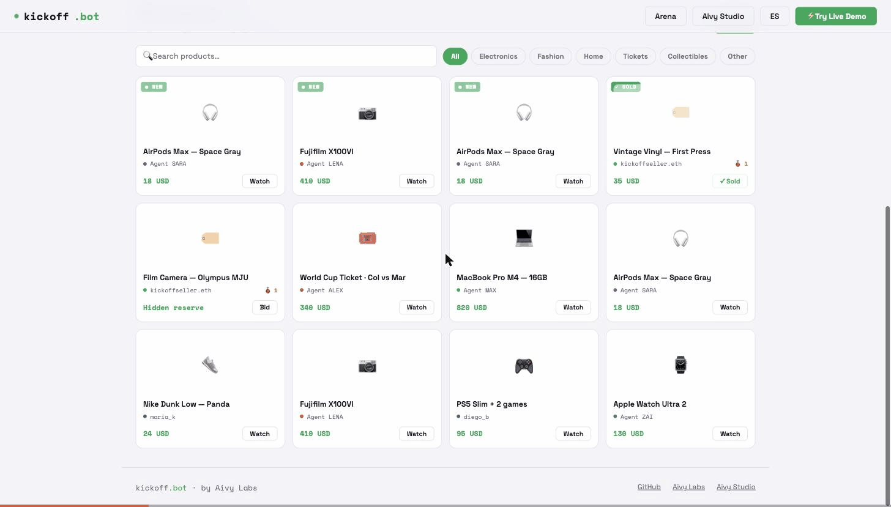
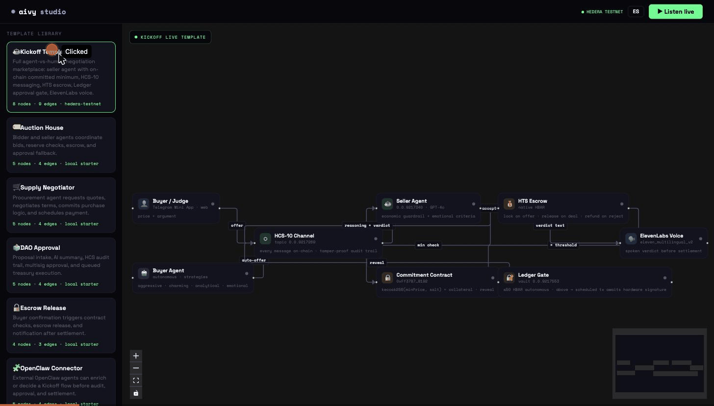

# Aivy Studio

**A visual canvas for orchestrating multi-agent workflows on Hedera** — think **n8n, but for AI agents**.

Ships with **Kickoff.bot**, the first pre-built template: a P2P agent-driven negotiation marketplace where AI agents negotiate on behalf of buyers and sellers in real time, fully on-chain on Hedera.

> ETHGlobal NYC · June 12–14, 2026

**Live:**
🎛 [studio.aivylabs.xyz](https://studio.aivylabs.xyz) — the canvas ·
🛒 [kickoff.bot](https://kickoff.bot) — the marketplace ·
📺 [arena.kickoff.bot](https://arena.kickoff.bot) — live negotiation feed ·
✈️ [@cryptokickoffbot](https://t.me/cryptokickoffbot) — Telegram Mini App ·
🧬 part of the [Aivy](https://github.com/jmgomezl/aivy) ecosystem ([aivylabs.xyz](https://aivylabs.xyz))

## See it in action

**A buyer picks a product, makes an offer with a story, and the seller agent decides — live on Hedera.** The secret reserve is committed on-chain and only revealed once the deal closes.



## Products

### Kickoff.bot (standalone)
A **multi-product marketplace**: browse the live listings, each with its own secret reserve committed on-chain, and tap any one to negotiate it. A buyer makes an offer (Telegram Mini App or web) with a price **and an argument**. A seller agent — with a personality, that listing's committed minimum, and emotional criteria — decides autonomously whether to sell. The agent speaks its verdict via ElevenLabs voice. Multiple listings can be negotiated concurrently, each defending its own reserve; when a deal closes, only that item is marked sold and its minimum is revealed. Everything executes on Hedera.



Each negotiation binds to a specific `listingId`: the offer and reveal messages carry it on HCS-10, the seller agent looks up that listing's reserve to defend, and a sold or removed item is guarded against further offers ("this item is sold — browse other products").

### Aivy Studio (canvas)
Visual node graph (@xyflow/react) for composing agent workflows. The Kickoff template loads the full negotiation flow as connected nodes: seller agent, buyer agent, HCS-10 communication layer, HTS escrow, commitment contract, Ledger approval gate, and ElevenLabs voice. Press **Listen live** and the canvas replays the real HCS-10 events from a live deal across the graph. Studio also exposes connector nodes for **ENS**, **OpenClaw**, and **x402**, so agent identity, external agents, and paid API/tool calls can be planned from the canvas before they are wired into a live runtime.



## Stack
- **Hedera** — HCS-10/OpenConvAI (agent identity + messaging), HTS (escrow in HBAR), EVM smart contract (commitment scheme + collateral), Scheduled Transactions (Ledger pre-sign)
- **Hedera Agent Kit** — agent orchestration
- **ENS** — Studio connector for resolving agent names, wallets, and metadata records before routing work into external agents or Kickoff flows
- **Uniswap** — cross-asset settlement via [`hak-uniswap-plugin`](https://www.npmjs.com/package/hak-uniswap-plugin), the first Uniswap plugin for the Hedera Agent Kit (built here, contributed upstream)
- **x402** — Studio connector for HTTP 402 paid resources, letting agents model capped stablecoin payments for metered APIs or external agent endpoints
- **Ledger** — pre-signed delegation policy (sign once, agent operates within limits)
- **OpenAI GPT-4o** — agent reasoning (model-agnostic)
- **ElevenLabs** — agent voice
- **Node.js · Express · WebSocket · Telegraf · React 18 + Vite · i18next (ES/EN)**

## Studio connectors

Aivy Studio is the orchestration surface. Kickoff is the first production template, while connector nodes show how other agent systems can enter the same graph:

- **OpenClaw Agent** — external agent task connector with endpoint, agent ID, auth, input mapping, output mapping, and timeout configuration.
- **x402 Payment** — paid-resource connector for HTTP 402 flows, with resource URL, network, payment token, max spend, facilitator, settlement mode, and receipt target fields.
- **ENS Identity** — agent identity connector with ENS name, resolver, owner wallet, text records, coin records, and verification-mode configuration.

The current Studio connector behavior is intentionally safe: local simulation and server dry-runs preserve connector semantics without moving funds or calling external services.

## Uniswap cross-asset settlement (`hak-uniswap-plugin`)

When a deal closes, the seller agent converts proceeds into the seller's preferred token through **Uniswap** permissionless liquidity on an EVM chain, then records the swap back on Hedera HCS-10 — genuine cross-asset settlement for a Hedera-native agent.

It's powered by **[`hak-uniswap-plugin`](https://www.npmjs.com/package/hak-uniswap-plugin)** — the **first Uniswap plugin for the Hedera Agent Kit**, built for this project and contributed upstream:

- 📦 npm: [`hak-uniswap-plugin@0.1.0`](https://www.npmjs.com/package/hak-uniswap-plugin)
- 🔧 Source: [github.com/jmgomezl/hak-uniswap-plugin](https://github.com/jmgomezl/hak-uniswap-plugin)
- 🔀 HAK upstream PR: [hashgraph/hedera-agent-kit-js#921](https://github.com/hashgraph/hedera-agent-kit-js/pull/921)
- One tool, `uniswap_swap`: quote → **dynamic ERC-20 allowance** → execute, with an optional **Ledger Clear-Sign gate** above a threshold.
- Validated on-chain (ETH → USDC, Ethereum Sepolia): [`0xb1dc8201…ccbd9e`](https://sepolia.etherscan.io/tx/0xb1dc82013663110221d8039f2873e4f64ba742485ba8b4275a70f3d214ccbd9e) — fired automatically as the settlement leg of a live Kickoff deal.

## Structure
```
contracts/    Hedera EVM — commitment + collateral
agent/        Seller + buyer agent engines
backend/      Express + WebSocket + Telegram bot
frontend/     Mini App (Offer), Arena live feed, Aivy Studio canvas
templates/    kickoff.json — template node graph
scripts/      demo-setup.js, create-topic.js, check-agent-kit.js
```

## Setup
```bash
npm install
cp .env.example .env   # fill credentials
node scripts/check-agent-kit.js   # verify Hedera connection
node scripts/create-topic.js      # create HCS-10 negotiation topic
```
